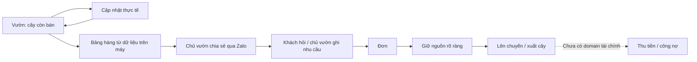

# Vườn Ươm V2 — Information Architecture

Ngày: 09/10/2026. **V2 ROADMAP BLUEPRINT / UI NOT IMPLEMENTED**.

Scope/thứ tự hiện hành theo [V2 Roadmap](V2-ROADMAP.md) và [V2-A Contract](V2-A-FUNCTIONAL-CONTRACT.md); C/D/E là hypotheses có gate, không approval toàn sitemap.

Thiết kế dựa trên competitive teardown người dùng gửi và [screen/workflow audit](D:/Project-17/VuonUom/docs/product/V2-WORKFLOW-AUDIT.md). Snapshot audit cũ `ac68325` có FC5-1 chưa merge. Baseline implementation V2 là merged main `0d8d97a`; FC5/FC6 SUPERSEDED, FC5-1 preserved/not adopted. Không lấy closed_remaining từ snapshot làm expectation/dependency V2.

Đọc cùng: [route/component map](D:/Project-17/VuonUom/docs/product/V2-ROUTE-COMPONENT-MAP.md), [general readiness audit](D:/Project-17/VuonUom/docs/architecture/GENERAL-COMMERCE-READINESS-AUDIT.md).

## 1. Product story và giới hạn

**Điểm vào:** “Vườn mình còn bán được cây nào?”



Zalo là kênh giao dịch bên ngoài app. Chia sẻ bảng text không tự tạo order/reservation. Mũi tên tới tiền là hướng cần nghiên cứu, không là chức năng đã có. Anonymous request intake/public live availability là một kiến trúc publishing riêng nếu được duyệt.

Mục tiêu IA: tìm số đúng nhanh, chọn đúng lô/đơn, thấy hậu quả trước write. Không thiết kế storefront/ERP/accounting để hoàn thiện sơ đồ.

## 2. Navigation

### Entry proposal ban đầu: bốn tab

| Tab đề xuất | Vai trò | Destination / dependencies |
|---|---|---|
| **Hôm nay** | Việc cần chú ý, cây còn bán, chuyến cần xuất | Giữ `/today`; reorder/query sau scope review |
| **Vườn** | Availability rồi drill-down lô | `/garden` là route đề xuất; `/batches` vẫn tồn tại như lô list |
| **Đơn** | Nhu cầu, nguồn giữ, planned/actual shipments | Giữ `/orders` và order detail/reserve |
| **Thêm** | Khách, sổ chuyến, hồ sơ/backup/settings/pilot tools phù hợp | Giữ `/more`; không menu rỗng |

`+ Cập nhật` là contextual action, không phải tab hoặc nút nổi thứ hai tranh CTA. Trên chi tiết lô, mở action của chính lô đó; trên Vườn, chọn lô trước. Trên form/confirmation, ẩn entry cập nhật để tránh phá draft.

**Khách** bắt đầu từ Đơn/Thêm và customer selector; đưa lên tab thứ năm chỉ sau evidence dùng lặp và review navigation riêng. Current nav vẫn `Hôm nay | Lô cây | Đơn hàng | Thêm`; mọi tên/route mới trong bảng là proposal, không đổi code ở task này. Bốn tab ban đầu cũng giữ phù hợp skill UX hiện tại; không cần trì hoãn bản IA để xin sửa skill.

Shipments không mất khi chuyển nav: entry từ order detail, Today planned queue và Thêm → Sổ chuyến. Dossier giữ entry trong lô. Validation/pilot tools là công cụ nghiên cứu, không trộn vào dashboard bán hàng cho khách.

## 3. Từ điển thông tin

| UI label | Authority | Không được suy diễn |
|---|---|---|
| Cây còn sống | `Batch.currentQuantity` | Không gồm cây đã hao hụt/xuất; nguồn ngoài không là own stock |
| Cây đủ bán | `Batch.readyQuantity` | Chất lượng đủ xuất vườn, chưa trừ O |
| Cây còn bán | `availableQuantityForBatch()` | Header “Sẵn bán” có thể là short copy, vẫn cùng metric này |
| Đang giữ / Đã giữ chưa xuất | O active `Q−F` | Không dùng historical Q hoặc order coverage C làm current hold |
| Thiếu cây đã giữ | `commitmentShortageForBatch()` | Không ẩn bằng stock thừa lô khác |
| Đã xuất | Completed shipment S | Không khẳng định đã giao tới khách hoặc đã thu tiền |
| Còn phải xuất | Số đặt trừ số thực sự đã xuất cho đơn đang hoạt động; dùng helper hiện có | Không phải “Thiếu nguồn”; closed_remaining/stopped chưa có trên baseline V2 |
| Thiếu nguồn | R−C theo canonical helper cho active order | Released source còn đóng góp F vào C |
| Chưa đủ bán | `living−ready` ở read model legacy | Không mặc định toàn bộ là dưỡng/yếu/bệnh |
| Hao hụt | Ghi nhận thay đổi/history có lý do | Không là một bucket của tồn sống; initial−living có thể gồm shipment |
| Chưa chốt giá | `unitPrice` chưa có | Không hiển thị 0đ, không infer catalog price |
| Công nợ | Chưa có authority | Không infer từ thiếu Payment records; không hiện widget 0 |

Availability summary sum các số đã derive từng lô. Supplier cards thể hiện outstanding commitment/contact; không thêm supplier quantity vào own inventory/availability. Dữ liệu thiếu → giải thích thiếu/không hiển thị section; dữ liệu sai → báo cần kiểm tra, không tự clamp/copy UI để biến thành hợp lệ.

## 4. Screen specifications

### S01 — Hôm nay

**Câu hỏi:** Bán được gì và cần xử lý việc nào trước?

Thứ tự thông tin:

1. Vườn + ngày; mode demo/pilot rõ, không chart doanh thu.
2. **Cây còn bán** own total, CTA **Xem cây còn bán**; target `/garden` nếu slice đó tồn tại, fallback `/batches?filter=ready` trong prototype.
3. Cần chú ý: thiếu cây đã giữ theo lô, đơn thiếu nguồn, sắp quá lứa; mỗi dòng có tên/mã và link authority. Chưa có weak/overdue-hold/debt counters.
4. Chuyến chờ xuất/ngày hẹn theo facts; không gọi mọi open order là “chờ xác nhận” khi không có status đó.
5. Entry **Ghi đơn** và **Cập nhật lô** ít nút, theo task context.

Zero state: chưa có lô → **Thêm lô đầu tiên**. Có lô nhưng available=0 → nói “Chưa có cây còn bán”, vẫn cho xem lô/đơn/cảnh báo. Không lấy external promises để làm hero own total dương.

### S02 — Vườn / Availability

**Câu hỏi:** Giống nào còn bán, nằm ở những lô nào?

- Search theo tên giống/mã lô ở slice legacy; không placeholder “size/khu” trước khi có searchable facts.
- Default view Cây còn bán; chuyển Tất cả để xem cả unavailable/propagating. Chỉ render filters có model và behavior.
- Card group: tên giống, cây còn bán, đang giữ O, shortage nếu có; số lô và tên lô để drill down. Group key legacy không giả là product/variant identity.
- Chưa có stock pricing policy nên không derive 35k–40k từ giá các đơn cũ. Chưa có size/location nên không có chip “không rõ A2” hoặc count 128 giống/size.
- CTA row **Xem lô**, **Ghi đơn**; create vẫn ghi nhu cầu trước, owner chọn source sau.
- Action **Tạo bảng chia sẻ** chỉ hiện khi local share slice được duyệt và triển khai.

Future item mode: stable item/variant → size/location/condition facets theo contract. Summary chứa total+breakdowns nhưng không gộp hai SKU chỉ vì tên giống giống nhau. No-results khác empty workspace; clear search/filter không write DB.

### S03 — Chi tiết cây / item

**Status:** future model-dependent. Chưa có route persisted item trong app.

Sau identity/variant contract: title và variant/options → cây còn bán → living/ready/O/shortage → các lô/location có lượng → prices explicit → history/dossier/photo sections thực sự có → Ghi đơn / Cập nhật.

Tạm thời một nhóm giống chỉ là filtered Availability view + batch drill-down; không cần một entity hoặc product page giả để hoàn thành sitemap. Không mất lô/history để ưu tiên ảnh chưa có storage.

### S04 — Chi tiết lô

**Câu hỏi:** Lô này còn bán bao nhiêu; thay số có ảnh hưởng khách nào?

1. Mã lô + giống; future size/location chỉ sau model.
2. Cây còn bán lớn; living/ready/O rõ đơn vị; thiếu cây đã giữ gần summary.
3. **Kiểm kê** và **Cập nhật cây đủ bán** mở flows có before/after và guard ready≤living. Có shortage thì **Điều chỉnh nguồn giữ** mở Trigger B; không tự chọn khách chịu thiếu.
4. Commitments/đơn liên quan có stable order differentiator, link đúng order/shipment. Two identical customer/date/quantity cards không được chỉ phân biệt bằng màu.
5. History và dossier nằm sau summary/action; photo future nếu có persistence/backup contract.

Interim không thêm “Chuyển cây”, “Cập nhật size” hoặc restock vào lô cũ. **Thêm lô mới** khác tăng stock vượt initial. Existing FC3 chuyển cam kết không dùng làm physical move.

### S05 — Cập nhật nhanh

Chooser đầu tiên chỉ gồm **Kiểm kê số sống**, **Cập nhật cây đủ bán**, **Thêm lô mới**. Context lô có sẵn thì bỏ bước chọn lô; global entry cho search/chọn lô.

```text
Entry → chọn lô nếu cần → action cụ thể → nhập
      → preview trước/sau + khách bị ảnh hưởng
      → commit service → reload authority → success
```

Không cam kết cứng 3–4 thao tác nếu cần confirmation để bảo vệ stock; mục tiêu là không mở Edit Product 25 fields. Back giữ draft phù hợp; double-submit/retry theo semantics từng service; không gắn useConfirmation chung nếu service chưa có fingerprint/idempotency contract.

**Hao hụt delta** cần command riêng re-read/validate/commit hoặc expected-state confirmation. Không lấy living lúc mở form trừ N rồi gửi absolute value để âm thầm ghi đè interleaving update. Move/size/condition/photo cũng cần contracts mới trước khi có action.

### S06 — Đơn

**Câu hỏi:** Khách đặt gì, đã giữ chưa xuất bao nhiêu, thiếu nguồn bao nhiêu, đã xuất bao nhiêu?

List dùng current canonical derived statuses và date filters; quotes/debt chưa thành tabs. Card ưu tiên khách, giống/quantity, ngày hẹn, shortage và một identifier ngắn ổn định đã thiết kế collision policy; không giả có order code trong record.

Detail: requested R; O giữ chưa xuất; S đã xuất; thiếu nguồn; current planned shipment; next action hợp lệ. C phủ nhu cầu vẫn là authority tính shortage/status, không relabel C thành cây đang giữ. Nếu source batch thiếu stock, cho biết dù C đủ.

Existing actions: edit metadata/quantity có intent-only payload; cancel chỉ trước completed shipment; reserve explicit; reconcile when conflict; plan/confirm shipment. Sau reconciliation, metadata draft cần commit riêng; không giả “Đã lưu toàn bộ đơn”.

FC5 close remaining là capability **preserved/not adopted**, ngoài active V2 roadmap; không thêm CTA/modal/enum hay coi service này là prerequisite. V2 giữ guards/lifecycle FC0–FC4 trên merged baseline. Contract stopped≠released lưu làm reference nếu capability được mở lại riêng.

Future commercial intent: draft/quote chuyển thành order qua operation explicit; không ghi reserve vì user mới sửa báo giá. Future payment panel là chiều khác, có thể “Đã xuất đủ · Còn nợ”; full cancel/close không tự refund hoặc xóa lịch sử tiền.

### S07 — Khách

V2-B2 read views `/customers`, `/customers/:id`: tên/phone/roles → đơn → O chưa xuất theo các đơn → lịch sử xuất/đơn; Ghi đơn / Gọi / Xem đơn. Khách customer-only không âm thầm trở thành supplier.

Không hiện “Đang giữ 7 triệu” bằng tổng quoted order value để giả giá trị tiền đã thu/nợ. Price agreement/customer tiers/payment/debt chỉ sau authority; chưa có thì không section Thu tiền. Unknown phone → bỏ Gọi và giải thích được, không cản tạo đơn.

### S08 — Bảng hàng / chia sẻ

V2-B1 `/garden/share`, owner-only local snapshot:

1. Chọn những giống/lô và fields muốn share; available derive hiện tại.
2. Preview chính xác nội dung, tên vườn, generated-at; ghi snapshot trên máy.
3. **Sao chép bảng hàng**; Web Share nếu được hỗ trợ là phương tiện gửi, luôn có copy/manual fallback. Không hứa deep link Zalo/auto-send; owner tự gửi.
4. Share read-only, không reserve, không public contacts/history/private notes. Giá không có policy thì bỏ, không đoán từ đơn cũ.

Public phase riêng: publish snapshot → URL khách đọc → gửi yêu cầu → owner nhận/review → current order/service validate khi giữ. Availability khách nhìn có thể stale; request không bảo đảm có hàng. Expiry/unpublish/content scope bắt buộc có semantics trước khi gọi là live. Backend/cloud gate hiện chưa được mở.

### S09 — Thêm

Prototype: Sổ chuyến, dossier entry phù hợp, backup/restore, workspace/mode, validation/pilot tools. Customer entry thêm khi customer read slice có thật.

Future settings chỉ hiện module đã được triển khai: items/variants/locations hoặc giá nếu đã có authority. Không menu rỗng Nhập hàng, Thu chi, Nhân viên, Integrations, Accounting. Archive terminal order/history không phải delete hoặc undo an toàn tự động.

## 5. Data dependencies và tối thiểu model

| Capability | Dùng legacy facts được? | Gate trước UI |
|---|---|---|
| Availability theo giống/lô | Có, read-only projection | Reuse canonical helpers, sum per-batch, uncertainty labels, search/custom variety |
| Customer order history | Có | Filter customer role, order/history references, money không giả |
| Snapshot text share | Có, không public receiver | Preview explicit fields; timestamp meaning; no write/reserve |
| Size/grade bán khác nhau | Không đủ bằng variety string | Stable sellable identity + mapping/compatibility trong reservation/ship/reconcile |
| Vị trí whole-batch | Có thể thêm link sau contract | Location name/id; history/backup; không gọi assignment là quantity movement |
| Chuyển một phần / một lô nhiều nơi | Không | Stock slices/location balances; source/destination atomic conservation; allocation affinity |
| Condition buckets | Không | Orthogonal condition/readiness policy; exclusivity/totals; shortage không bị che |
| Photo | Không | Persisted media references/content, storage limits/restore/offline behavior; không chỉ File object in-memory |
| Quotes + multiple items | Không | Commercial-intent + OrderLine authority, snapshots, legacy adapters |
| Payments/debt/customer prices | Không | Billing basis, money/currency, payments/reversals/history; contract scope riêng |
| Public link/request inbox | Không | Publisher/transport/access boundary, stale/dedup, withdrawal; explicit backend scope |

Tối thiểu conceptual future core: `SellableItem/Variant` cho cái bán được; `Batch` cho nguồn sinh học; `Location` cho nơi; stock slices chỉ khi partial placement thực sự cần; `OrderLine` khi nhiều hàng; `Payment` khi bài toán tiền được duyệt. Không yêu cầu build tất cả cùng lúc; inventory events vẫn audit/history, không event sourcing. Chi tiết additive migration trong readiness audit.

## 6. Delivery slices và pilot gates

| Slice | Outcome | Dependency / không bao gồm |
|---|---|---|
| **V2-A1/A2/A3/A4 — Availability & quick entry** | Read model → UI/search → quick composition → Today/nav | G01/G02/G10 cleanup trước; V2-A Contract đã freeze; không size/location/condition/schema rewrite |
| **V2-B1/B2 — Local bảng hàng + customer read** | Preview text/copy/share → customer reads | Sau A acceptance; không live/public intake/giá khách/payment/công nợ |
| **REAL PILOT / STOP FEATURE BUILD** | Năm task trên số liệu/điện thoại thật; đo time/taps/sai lô/nhầm ready-available/Excel | Ngay sau B; không chờ FC5/FC6/C/D/E |
| **V2-C — Identity & nursery facts** | Hỗ trợ grade/size hoặc location theo pain point pilot | Contract/migration/backup/current-state guards trước UI; whole-batch labels và partial movements tách slice |
| **V2-D — Commercial intent / finance tối thiểu** | Quote/payment/debt nếu thực sự dùng | Product validation và scope finance; không full accounting/payment gateway; multiline cần OrderLine trước |
| **V2-E — Public sharing/request intake** | Khách đọc/gửi yêu cầu trên thiết bị riêng | Publishing scope/backend authorization và confirmed data boundary; không tự reserve |

C/D/E không có lịch hoặc priority bắt buộc; dependency yêu cầu không đồng nghĩa phải xây. Không giả định phải có customer finance trước khi thử bảng share text. Roadmap thực thi là cleanup → A1/A2/A3/A4 → B1/B2 → real pilot; FC5/FC6 SUPERSEDED và không prerequisite. C/D/E chỉ mở theo evidence/scope riêng; D tách D1 quote/commercial intent và D2 Payment/Debt/Reversal/Deposit.

## 7. Review / acceptance theo từng slice roadmap

- Source audit + prototype với data hiện tại trước styling; review một slice, không approve mọi screen.
- 360/390/430px: một cột, CTA ≥48px, target ≥44px, body rõ ngoài trời; tablet/desktop cùng authority, list/detail chia cột khi hữu ích.
- Người dùng phân biệt living/ready/available/O/shortage; không nhầm thiếu nguồn với còn phải xuất; duplicate customer orders phân biệt được.
- Preview invalid không hiển thị số dự phóng sai; shortage cho ghi thật; mutation service vẫn authority, stale/storage retry không auto-confirm.
- No-data/missing/not-implemented không dùng số 0 giả. Offline chỉ tuyên bố những gì đã kiểm bằng device/PWA acceptance.
- Share chỉ read/export; public publish hoặc write phải là action explicit. History/Undo/backup invariants không mất khi thay composition.

Không có UI V2 nào được browser nghiệm thu trong tài liệu này. Evidence responsive ở readiness audit là của current screens cùng HEAD, không phải target IA.
