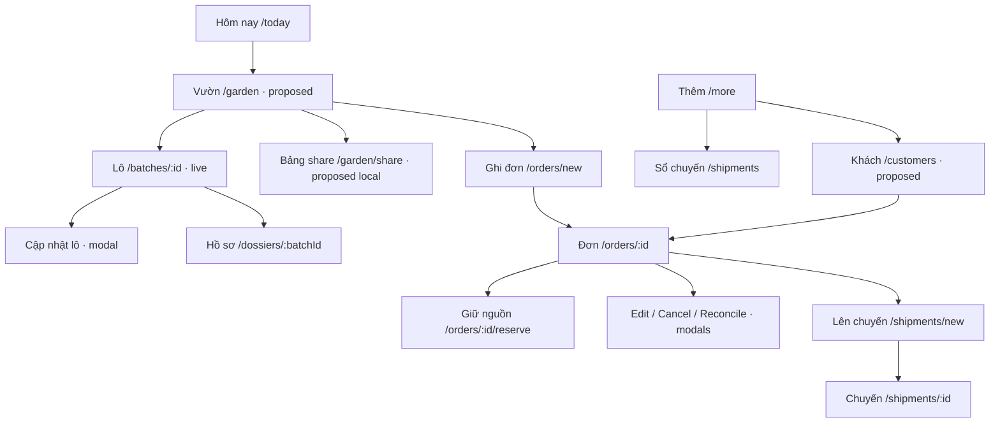

# Vườn Ươm V2 — Route & Component Map

Ngày: 09/10/2026. **V2 ROADMAP IMPLEMENTATION MAP — NO ROUTES/COMPONENTS IMPLEMENTED BY THIS DOCUMENT**.

Authority: [V2 Roadmap](V2-ROADMAP.md), [V2-A Contract](V2-A-FUNCTIONAL-CONTRACT.md). FC5/FC6 SUPERSEDED; cleanup → A1/A2/A3/A4 → B1/B2 → real pilot. C/D/E chưa mở.

Snapshot `ac68325b8deab6445e833b6f7c78c28fa97f9484`. Đọc [workflow audit](D:/Project-17/VuonUom/docs/product/V2-WORKFLOW-AUDIT.md) → [IA](D:/Project-17/VuonUom/docs/product/V2-INFORMATION-ARCHITECTURE.md) → map này. `LIVE` là existing route giữ từ merged main `0d8d97a`, không phải production. Audit snapshot `ac68325` có FC5-1 nhưng capability đó preserved/not adopted, không nằm trong map commands active bên dưới.

## 1. Route inventory đang có

Authority: [router.tsx](D:/Project-17/VuonUom/web/src/app/router.tsx:110), [navigation.ts](D:/Project-17/VuonUom/web/src/shared/navigation.ts:10). Shared [AppShell](D:/Project-17/VuonUom/web/src/shared/components/AppShell.tsx:13); onboarding guard qua [bootstrapApp](D:/Project-17/VuonUom/web/src/app/bootstrap.ts:12).

| Route LIVE | Component thực tế | Vai trò / entry |
|---|---|---|
| `/` | RootRedirect | Chọn onboarding/today theo workspace |
| `/onboarding` | OnboardingScreen | Mở sổ/demo/pilot |
| `/today` | TodayScreen | Hero số lượng + attention + planned shipments |
| `/batches` | BatchesScreen | List/filter lô; query `filter` có allowlist |
| `/batches/new` | BatchNewScreen | Thêm lô mới, custom variety |
| `/batches/:id` | BatchDetailScreen | Stock summary, inventory/ready/reconcile modals, dossier/history |
| `/orders` | OrdersScreen | List/filter đơn theo trạng thái derive |
| `/orders/new` | OrderNewScreen | Customer + variety + quantity/date/optional price/note |
| `/orders/:id` | OrderDetailScreen | Edit/cancel/reserve/ship/current history |
| `/orders/:id/reserve` | OrderReserveScreen | Own/external candidates, explicit reserve/release, supplier quick create |
| `/shipments` | ShipmentsScreen | Planned/completed list từ Thêm/Today |
| `/shipments/new` | ShipmentNewScreen | Chọn order/allocation, planned quantity/date |
| `/shipments/:id` | ShipmentDetailScreen | Preview source effects, confirm/cancel planned/history |
| `/dossiers/:batchId` | BatchDossierScreen | Hồ sơ nguồn gốc lô |
| `/more` | MoreScreen | Chuyến/backup/workspace/settings/pilot entry |
| `/validation` | ValidationReportScreen | Research telemetry/report |
| `/pilot-tools` | PilotToolsScreen | Pilot support |
| `*` | Navigate `/` | Current unknown route fallback |

Các route `/orders/new`, `/batches/new`, `/shipments/new`, `/orders/:id/reserve`, `/dossiers/:batchId` là focused task; AppShell ẩn mobile nav, desktop vẫn theo layout rule. Existing edit/cancel/reconciliation là modal trong detail, không có route độc lập.

## 2. Target route map và trạng thái

`READ/UI V2-A/B`: dùng facts hiện có theo từng slice roadmap, cần gate/acceptance trước tích hợp; không implementation toàn sitemap. `DOMAIN GATED`: có contract/migration dependency. `PUBLISHING GATED`: public boundary mới, hiện chưa được phép backend.

| Proposed route | Screen / UI name | Status | Dependency / interaction |
|---|---|---|---|
| `/garden` | GardenAvailabilityScreen / Vườn | READ/UI V2-A1/A2 | Group/read per-batch availability; entry proposal thay tab Lô cây sau scope review |
| `/garden?q=…&view=available&variety=…` | Filtered Availability | READ/UI V2-A2 | Query chỉ chọn view/search/legacy label, không persisted identity hoặc mutation intent |
| `/batches` + current details | Danh sách/chi tiết lô | KEEP LIVE | Entry từ Garden; giữ URLs/history/links và toàn flow cũ |
| `/garden/share` | AvailabilityShareScreen / Bảng hàng | READ/LOCAL SHARE V2-B1 | Owner preview/export/copy; không public URL; share route trên máy khách không có data |
| `/customers` | CustomersScreen / Khách | READ/UI V2-B2 | Customer role + current contact/order/reservation projections |
| `/customers/:id` | CustomerDetailScreen | READ/UI V2-B2 | Order list/history/O count; gọi/tạo đơn. Không Thu tiền/debt widgets |
| `/garden/items/:itemId` | ItemAvailabilityDetailScreen | DOMAIN GATED V2-C | Stable item/variant authority + compatibility; không dùng batchId giả productId |
| `/locations` | LocationsScreen | DOMAIN GATED V2-C | Whole-batch placement contract trước; partial movement là gate riêng |
| `/locations/:locationId` | LocationDetailScreen | DOMAIN GATED V2-C | Stock-location read authority đã có; không parse `sourceNote` làm movement record |
| `/quotes`, `/quotes/:quoteId` | Quote list/detail | DOMAIN GATED V2-D | Commercial intent + conversion/history; chưa có quote status/schema/service |
| `/orders/:id/payments` | Order payments | DOMAIN GATED V2-D | Billing basis, payments/reversals/idempotency; tách fulfillment |
| `/a/:publicationToken` | PublicAvailabilityPage | PUBLISHING GATED V2-E | Chạy trên public publisher/host riêng; không bên trong owner onboarding guard |
| `/a/:publicationToken/request` | Public request form | PUBLISHING GATED V2-E | Request transport/inbox/dedup; không anonymous reserve trực tiếp |

Chưa đăng ký các route đề xuất vào router hoặc nav. Không tạo menu disabled giả app đủ chức năng; mỗi release chỉ lộ những capabilities đã có domain/acceptance. Public `/a/...` chỉ là shape dự kiến, không hứa host/URL tồn tại.



## 3. Query và deep-link rules

- Giữ current URLs: planned links `/shipments/:id`, dossier batchId và existing order/batch refs không đổi hàng loạt khi rename tab.
- `OrderNewScreen` hiện đọc `variety` query; **chưa đọc `customerId`, `itemId` hoặc `batchId` để tự reserve**. BatchDetail đang truyền batchId+variety, nhưng create demand không cam kết chọn source. New customer/item-prefill là enhancement riêng, validate current existence/role/identity trước submit; không mô tả query đó như đã hoạt động.
- Garden query chỉ filter read projection. Whitelist `view`, sanitize/normalize search, preserve valid filter khi back; unknown values fallback rõ. Không dùng query params làm permission/canonical quantity/confirmation token.
- Legacy variety query ngoài common options cần picker correction G10; visible selected label phải khớp draft/submit. Không dùng slug tạo từ tên giống làm permanent item key.
- Generated stable item/order display IDs phải có mapping/collision policy; không lấy random ordinal của sorted list để phân biệt đơn lâu dài. Nếu chỉ dùng shortened existing ID, resolve uniqueness và hiển thị full ID trong detail khi cần.
- Direct link tới terminal order/reserve/ship phải fail closed như service; ẩn action không thay authority. Not-found/deleted ref có đường quay lại list, không mở form mutation trống.
- Deep link vào proposed route trước release không được được coi là capability đã có. Không redirect `/batches` sang `/garden` cho tới khi backward navigation/filter behavior có regression.

## 4. Existing component map

| File / symbol | Có thể reuse | Giới hạn phải giữ |
|---|---|---|
| [AppShell](D:/Project-17/VuonUom/web/src/shared/components/AppShell.tsx:13), BottomNav/DesktopNav | Responsive frame, focused task navigation | NAV_ITEMS hiện 4; đổi route/labels theo slice, không thêm commerce modules tự động |
| [PageHeader](D:/Project-17/VuonUom/web/src/shared/components/PageHeader.tsx), PrimaryButton/SecondaryButton | Title/back/action, CTA | Domain/error semantics không đưa vào primitive |
| [EmptyState](D:/Project-17/VuonUom/web/src/shared/components/EmptyState.tsx), OfflineBadge | Empty/error/navigation status | Offline badge không chứng minh public data synchronized |
| [QuantityInput](D:/Project-17/VuonUom/web/src/shared/components/QuantityInput.tsx:5) | Plant count/cây-vạn input và preview | Niche adapter; chưa generic unit/decimal quantity; không gọi đổi unit là no-op cho acknowledgement |
| [BatchCard](D:/Project-17/VuonUom/web/src/shared/components/BatchCard.tsx) | Leaf batch list | Không đổi tên ProductCard rồi assume item/variant/location/price |
| [OrderCard](D:/Project-17/VuonUom/web/src/shared/components/OrderCard.tsx) | Current single-line order + derived status | C/F/O labels đúng meaning; không payment status hoặc multiline UI giả |
| [InventoryUpdateModal](D:/Project-17/VuonUom/web/src/features/batches/InventoryUpdateModal.tsx:21) | Absolute living/ready kiểm kê + impact preview | Không delta-mortality hay location movement; invalid projection không có số giả |
| [ReadyQuantityUpdateModal](D:/Project-17/VuonUom/web/src/features/batches/ReadyQuantityUpdateModal.tsx:16) | Update ready, show shortage | ready≤living; commitment shortage được phép tồn tại |
| [ContactQuickCreateModal](D:/Project-17/VuonUom/web/src/features/orders/ContactQuickCreateModal.tsx) | Customer/supplier creation đúng role | Không tự đổi role contact cũ; phone optional supplier đúng FC4 |
| [ReserveQuantityModal](D:/Project-17/VuonUom/web/src/features/orders/ReserveQuantityModal.tsx), ReleaseConfirmModal | Explicit quantity/source; acknowledgement; outstanding release | No external inventory estimate/autofill; historical Q không là release quantity |
| [OrderEditModal](D:/Project-17/VuonUom/web/src/features/orders/OrderEditModal.tsx:15), OrderCancelModal, OrderActionDialog | FC2 corrections; intentional metadata; preview cancel | Không overwrite untouched stale fields; cancel validation tại commit |
| [OrderReconciliationModal](D:/Project-17/VuonUom/web/src/features/orders/OrderReconciliationModal.tsx:15), BatchReconciliationModal | FC3 A/B preview/confirm/partial outcomes | Transfer là commitment, không physical movement; planned guards, metadata separate save |
| [useConfirmation](D:/Project-17/VuonUom/web/src/features/reconciliation/useConfirmation.ts:7), AbsoluteQuantity/Impact/ReconciliationError | Strict preview lifecycle khi service tương ứng có contract | Không dùng để tự tạo atomicity/idempotency cho service thiếu contract |
| [orderHistoryMessage](D:/Project-17/VuonUom/web/src/features/orders/orderHistory.ts:4), UndoBanner | Event formatting/Undo service integration | Keep history payloads, guards; không auto-enable Undo cho new movement/payments/closure |

## 5. Proposed components — chỉ kế hoạch

Những đường dẫn dưới đây **chưa có file**, chỉ là implementation surface cho một slice được duyệt sau này. Tiếp tục feature folders, không dynamic form/plugin registry.

| Component candidate | Suggested path | Props/read facts | Authority / gate |
|---|---|---|---|
| GardenAvailabilityScreen | `D:/Project-17/VuonUom/web/src/features/garden/GardenAvailabilityScreen.tsx` | Query/view/selected group state | New read projection dùng canonical helpers, không formula duplicate trong JSX |
| AvailabilitySummary | `D:/Project-17/VuonUom/web/src/features/garden/AvailabilitySummary.tsx` | Living/ready/own O/available/shortage totals, context | Pure presentation; không total một nhóm bằng netting lô |
| VarietyAvailabilityCard | `D:/Project-17/VuonUom/web/src/features/garden/VarietyAvailabilityCard.tsx` | Legacy variety group + batch refs/counts | Ghi rõ nhóm giống, không stable SKU identity |
| GardenSearch / ViewFilters | `D:/Project-17/VuonUom/web/src/features/garden/GardenFilters.tsx` | q/view + available facets | Legacy name/code only; size/location facets gated |
| QuickUpdateChooser | `D:/Project-17/VuonUom/web/src/features/garden/QuickUpdateChooser.tsx` | Optional batch context, eligible existing actions | Reuse live modals; không new stock commands |
| StockImpactSummary | `D:/Project-17/VuonUom/web/src/features/garden/StockImpactSummary.tsx` | Before/after facts + shortage context | Nếu extract presentation từ modals, giữ riêng validation/commit semantics |
| AvailabilityShareScreen / SharePreview | `D:/Project-17/VuonUom/web/src/features/share/AvailabilityShareScreen.tsx` | Explicit selected public fields + snapshot time | Local export only; no reservation write, no backend URL |
| CustomersScreen / CustomerDetailScreen | `D:/Project-17/VuonUom/web/src/features/customers/` | Contact + order refs + outstanding/count/history | Read-only, current roles; no debt field fake |
| ItemAvailabilityDetailScreen | `D:/Project-17/VuonUom/web/src/features/items/` | Stable item/variant/slice projections | Domain gated C; do not scaffold today |
| LocationMovementPreview / ConditionChangePreview | `D:/Project-17/VuonUom/web/src/features/inventory/` | Projected balanced quantity/allocation impacts | Domain/migration/strict confirmation before UI |
| PaymentHistory / RecordPaymentModal | `D:/Project-17/VuonUom/web/src/features/payments/` | Valid billing/payment projection | Finance contract gated D; not implement in FC5 |
| PublicAvailabilityPage / RequestForm | Future publisher project | Published snapshot/request intent, not owner DB entities | Publishing gated E; not owner AppShell/IndexedDB access |

CloseRemainingModal/service/closed_remaining thuộc FC5 **preserved/not adopted**, ngoài active V2 roadmap. Không expose, import hoặc đưa vào dependencies V2-A/B; phải mở scope/review riêng nếu cần capability này sau pilot.

## 6. Query/service map

### Current commands stay authority

| User action | Current command | App reloads |
|---|---|---|
| Thêm lô | `batchService.createBatch()` | Batch/availability/history |
| Kiểm kê / cây đủ bán | `updateBatchInventory()` / `updateBatchReadyQuantity()` | Batch/reservations/availability/shortage |
| Ghi/sửa/hủy đơn | `createOrder()` / `updateOrder()` / `cancelOrder()` | Order/source/planned/history; G01/G02 patch still pending |
| Giữ/nhả | `reserveOwnBatch()` / `reserveExternalSupplier()` / `releaseReservation()` | Current source/coverage/O/stock read facts |
| Điều chỉnh nguồn | `reconcileOrderReduction()` / `reconcileBatchShortage()` | Current DB authority; not projection as permanent local state |
| Lên/xuất/hủy chuyến | `createShipment()` / `confirmShipment()` / `cancelShipment()` | Order/shipment/F/own stock/history |

Command names/symbols cần đối chiếu source lúc bắt đầu implementation; không có new generic `updateInventory()` thay mọi command trong map này.

### Named reads đề xuất

`D:/Project-17/VuonUom/web/src/services/gardenQueryService.ts` (proposed): `getGardenAvailability(query)` đọc batches/reservations trong một Dexie `r` transaction gồm cả batches/reservations theo V2-A Contract; gọi `availableQuantityForBatch`, `reservedOutstandingQuantityForBatch`, `commitmentShortageForBatch`; group sau derive. UI không đọc db trực tiếp hoặc giữ một availability cache khác authority. Query filters/sort không write quantity/status.

Conceptual DTO (chưa là persisted record):

```text
GardenAvailabilityView
  basis = legacy_variety
  capturedAt = time this local view was assembled
  ownTotals { living, ready, outstanding, available, commitmentShortage }
  groups[] { label, batchIds, same derived totals }
```

`capturedAt` không là last stocktake/sync time. Item mode/price/location không optional-filled zero để giả capability; thêm DTO variant khi model tương ứng thật sự có.

`D:/Project-17/VuonUom/web/src/services/customerQueryService.ts` (proposed): customers role + linked orders/reservations/completed shipments; O dùng canonical remaining helper. Money authority không tồn tại thì DTO không có `debtAmount/paidAmount=0`.

`D:/Project-17/VuonUom/web/src/services/availabilityShareService.ts` (proposed): re-read local view → project explicit share fields → generate text + timestamp. Read-only, không export backup raw, không send tới người khác tự động. Owner preview chính là nội dung sẽ copy; request ngoài app vẫn vào existing create/reserve flow để validate current authority.

## 7. State / confirmation / return paths

```text
Read view → select task → draft → validate preview
  → explicit confirm → transaction commit → reload current DB → outcome
```

- Existing inventory input absolute và existing reserve confirmation không tự được nâng thành strict reconciliation fingerprint. Mỗi command giữ contract riêng; new delta/multi-entity operation cần contract trước.
- FC3-style preview: edit plan invalidates snapshot; STORAGE_ERROR giữ same plan/fingerprint/operationId; PREVIEW_CHANGED bỏ old snapshot, refresh + new preview, cần click mới; operation-ID conflict fail closed/identity mới; service vẫn re-read.
- Modal back không thành mutation; metadata draft từ OrderEdit sau reconciliation chỉ ghi intentional fields qua separate save. Reload failed → không cho metadata commit bằng stale projection.
- Garden → BatchDetail → update/reconcile → back giữ search/filter, reload facts. Customer → OrderDetail → back giữ customer context. Close/cancel/terminal guard không bị route làm mất.
- Share preview không giữ cây; copy/export failure không alter stock/order. Sau export, snapshot cũ vẫn là snapshot; không toast “live inventory updated”.
- Public request confirmation, nếu được xây, chỉ là đã nhận yêu cầu; reserve success chỉ sau owner authority commit.

## 8. Implementation surfaces và regression gates

### V2-A: bốn slice trên facts hiện tại

Sau cleanup G01/G02/G10: A1 read/query + real Dexie snapshot tests → A2 Garden UI/search → A3 quick-update composition → A4 Today/nav integration. Mỗi slice có regression/CI/review; không gộp toàn A thành một PR. Không đổi schema; bất kỳ logic quantity mới nào phải được review riêng.

Files có khả năng chạm sau khi duyệt: proposed garden components/query service; [TodayScreen](D:/Project-17/VuonUom/web/src/features/today/TodayScreen.tsx); [router](D:/Project-17/VuonUom/web/src/app/router.tsx); [NAV_ITEMS](D:/Project-17/VuonUom/web/src/shared/navigation.ts). Batch/order/shipment command files chỉ là dependencies, không có lý do sửa mutation để thay hero/list UI.

Acceptance tests:

1. Group totals sum per-batch; shortage A và available B tồn tại đồng thời, không netting/auto-transfer.
2. Own totals không gồm external commitments; Q/F/O và released-F đúng sau partial ship/release/reconcile.
3. Search/filter/read/share không tạo reservation/order/event hoặc write batch.
4. Routes/filter back/direct links tới planned shipment/dossier/reserve không mất; unknown/deleted/terminal vẫn an toàn.
5. Quick chooser chỉ mở đúng existing flow; ready≤living guard và shortage preview giữ nguyên; create không tự reserve vì query prefill.
6. 360/390/430/768/1280px; no horizontal overflow, labeled targets, readable quantity. Keyboard/IME/PWA offline acceptance là evidence riêng, không suy ra từ screenshots.

### V2-B1/B2: local share/customer reads riêng, rồi real pilot

Snapshot fields whitelist, timestamp meaning, preview-copy parity; no stale-price inference/PII leakage from backup/private history. Unsupported Web Share → copy/manual; no automatic sending. Customer role/unknown phone, duplicate orders stable differentiator, terminal/history unchanged; no mock debt UI.

### V2-C/D/E gated

Reuse [readiness migration plan](D:/Project-17/VuonUom/docs/architecture/GENERAL-COMMERCE-READINESS-AUDIT.md:433): additive records/links, backup V2 nếu schema yêu cầu, legacy adapters và reader behavior. UI only after domain guards/races/stale/retry/Undo/backup gates tương ứng. Không tạo wildcard abstraction, generic form builder hoặc marketplace để “hoàn thiện map”.

## 9. Handoff checklist

Để giao coding task tiếp theo, chỉ định **một slice**, base merged, exact files/allowed authority và acceptance tương ứng; record explicit exclusions. Source/reference teardown không thay thế functional contract.

V2-0 cập nhật PROJECT_STATE/roadmap/contracts, không đổi NAV_ITEMS hoặc code V2 và không merge FC5-1. Bước coding tiếp theo: cleanup G01/G02, G10 rồi V2-A1; không chờ FC5/FC6. Real pilot sau B là bắt buộc trước C/D/E. Ba read contracts đã freeze tại V2-A Contract; A/B không schema mới.
